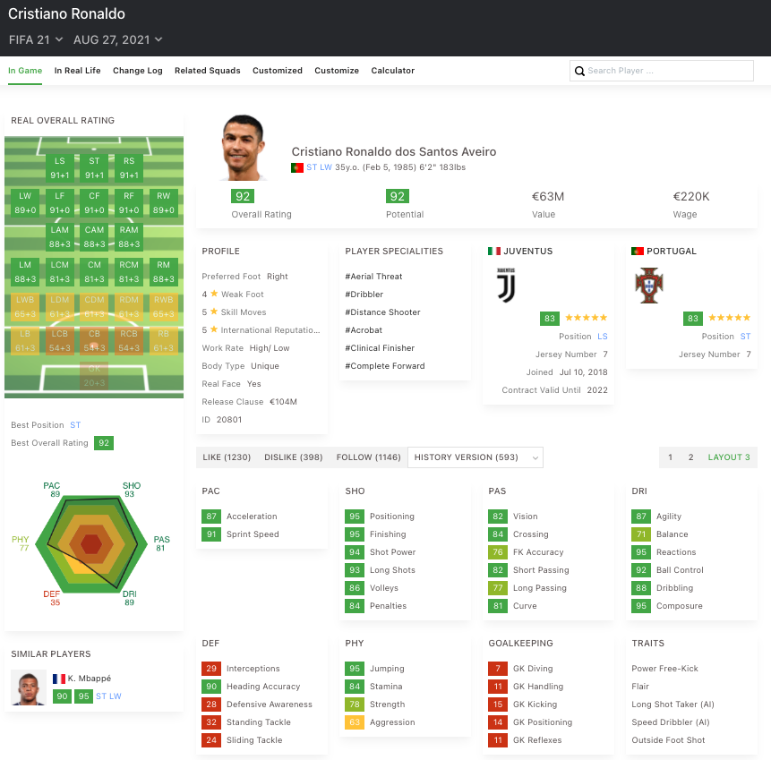
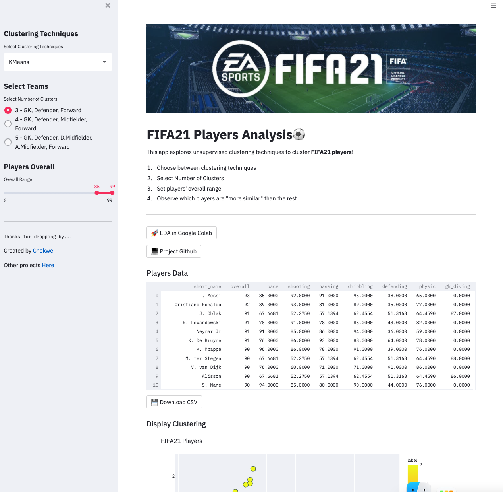
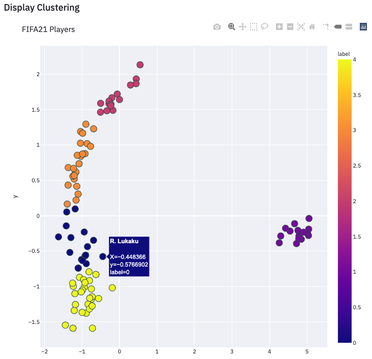

    

# FIFA21 Clustering Analysis⚽
Explore Unsupervised techniques to cluster FIFA21 players together.

1. Choose between clustering techniques

2. Select Number of Clusters

- `Clusters = 3`, one can expect to see clusters of GKs, Defenders, Attackers 

- `Clusters = 4`, one can expect to see clusters of GKs, Defenders, Midfielders, Forwards

- `Clusters = 5`, one can expect to see clusters of GKs, Defenders, Defensive Midfielders, Attacking Midfielders, Forwards

1. Set players' overall range to determine dataset

2. Observe which players are "more similar" than the rest

# Project Inspirations
- Firstly, it's for me to learn and experience with all the unsupervised clustering algorithms, as most of the times I have been working on supervised algorithms. 

- Secondly, as a leisure FIFA player myself, I emphatize that most of the times we will try to look for "alternatives" for our team players in improve our team. Or, when we are trying to purchase players during transfer windows, we always try to look for similar alternatives that are better bargains. This is especially so when we want to find players alike for legendary players like Leo Messi or Cristiano Ronaldo. 

    

    <i> https://sofifa.com/player/20801/c-ronaldo-dos-santos-aveiro/210059/>
    </i>

With all these attributes above, and by using various clustering techniques, we could then find out which players are "more similar" to each other. 

This project is also inspired by Youtuber @Import Data. Feel free to head over to his channel to check on his other works. 

# Python Packages
pandas, numpy, streamlit, scikit_learn, plotly

# Data
Data was extracted from [Kaggle](https://www.kaggle.com/stefanoleone992/fifa-21-complete-player-dataset). Data available includes FIFA15 all the way to FIFA21. In this project, analysis was conducted on FIFA21 players only.

# Data Cleaning
1. Cleaning up positional attributes. 
There are 20+ features which describe each players' capability to adapt to a particular position, when assigned. Eg. `"ST"` means striker, and players like Ronaldo has `"ST"` of `"91+1"` as a string, and Messi has `"89+3"` as a string. So the first task of data cleaning is to convert these values into an integer - Ronaldo's `"ST"` will become `92`, and Messi's will become `92` too. 

2. Drop non-numerical features
As the clusterng analysis aims to cluster players into groups, based on their physical attributes, we would discard the non-numerical features. Eg. `"long_name"`, `"nationality"`. `"club_name"`, `"player_positions"` etc. 

3. Drop irrelevant features
We will also drop features that are not beneficial to the clustering techniques. Eg. `"value_eur"`, `"wage_eur"`, `"team_jersey_number"` etc. 

4. Imputing missing values
Certain features are only reserved to describe GKs. `gk_diving`,`gk_handling`,`gk_kicking`,`gk_reflexes`,`gk_speed`,`gk_positioning`
We would impute zeros for these features, for all the non-GK players. 
Other features like `pace`,`shooting`,`passing`,`dribbling`,`defending`,`physic` also have missing values. We would use sci-kit learn's [iterative imputer](https://scikit-learn.org/stable/modules/generated/sklearn.impute.IterativeImputer.html) to impute these missing values. 

# Clustering Algorithms
1. The first algorithm explored is K-Means clustering. Before applying K-Means, data underwent PCA to reduce dimensionalities to two. 

# Interesting Findings
- Algorithms work decently as expeceted, able to segregate players distinctly. We can see defenders getting labeled differently, and attackers getting labeled differently as well. 

- Bruno Fernandes, Kevin De Bruyne and Roberto Firmino are three players are that closely similar to one another.

- Pogba, Modric, Thiago are another three players that are closely similar. 

- Neymar is more similar to Messi, than Ronaldo.

- Ederson and Neuer are more similar than other goalies. 

# Web Application
App is currently deployed free on [heroku](https://chek-fifa21-app.herokuapp.com/). 

    

    

After selecting clusterng algorithm, number of clusters to generate, and players' overall range, a dataframe will be displayed. User could scroll around and view the players' attributes in table form. If required, user could export the data as .csv to explore locally. 

User is able to mouse over any data points, and players' name will be display as hover text. 

# Other info
[Google Colab](https://colab.research.google.com/drive/1gtVNCDrjNk1yQCwCL21zIPHLkp7LdWvV?usp=sharing) for EDA

[Project Github](https://github.com/chekwei4/FIFA21_App)

[My other projects](https://chekwei4.github.io/Chek_Wei_Portfolio/)
